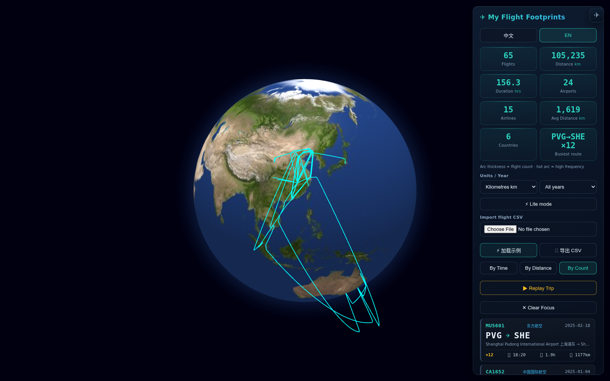
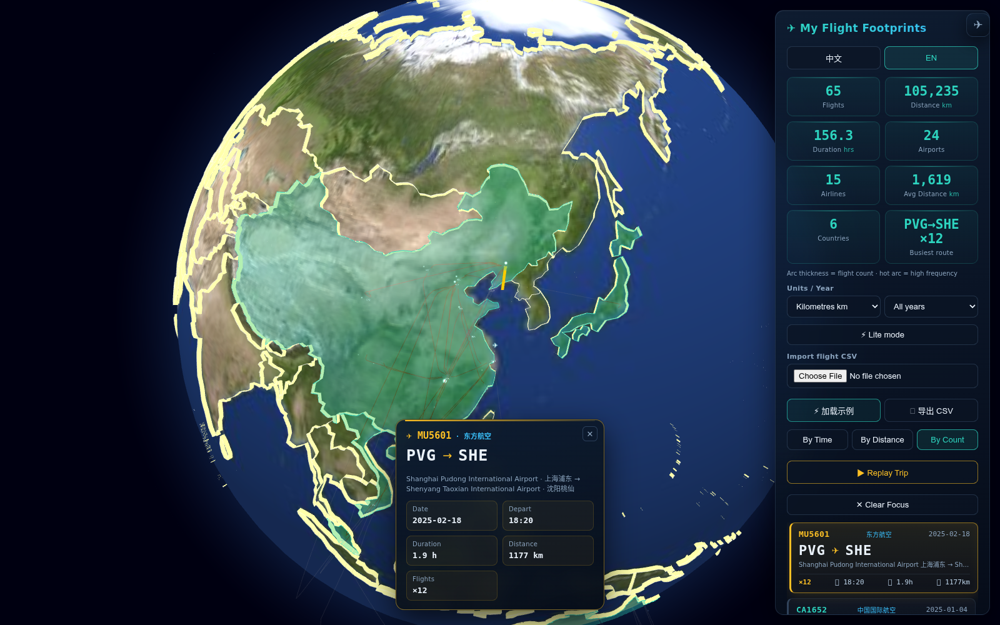
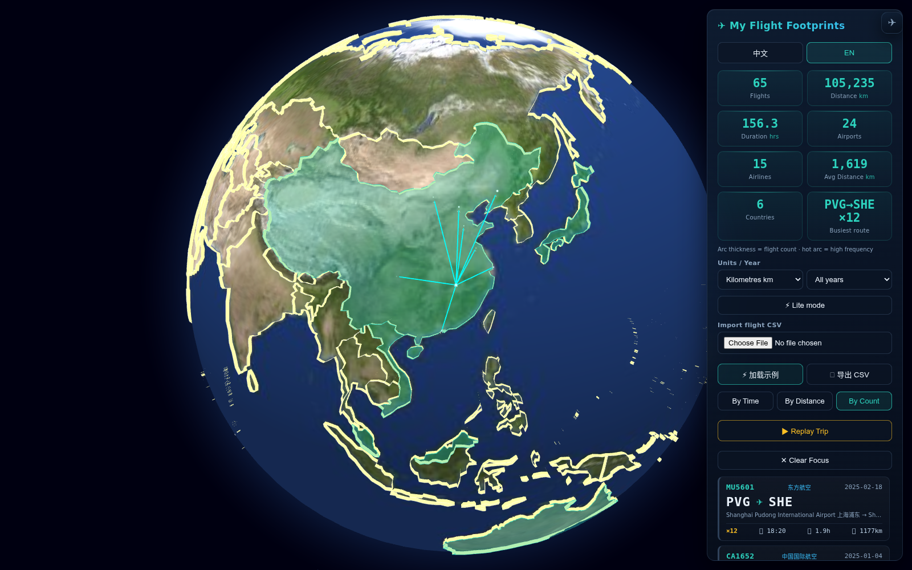
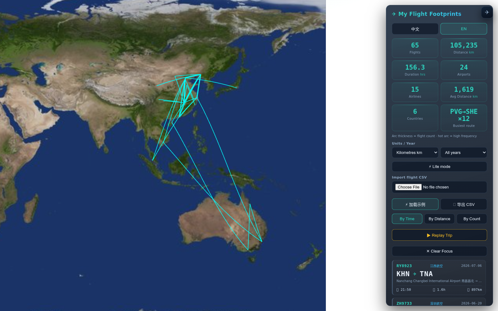

# ✈ Flight Footprints

<!-- README-I18N:START -->
**English** | [汉语](./README.zh.md)
<!-- README-I18N:END -->

> **A privacy-first flight tracker.** Import your flight CSV → get a cinematic 3D globe logbook. There is no server and no account: the app runs entirely in your browser and nothing is ever uploaded. The only way your data leaves the machine is the share link *you* generate and hand out yourself. [Try it live →](https://qgeng1465.github.io/flight-trajectory-visualizer/)

---

> **▶ Demo video (35 s):** [**Play it in your browser →**](https://qgeng1465.github.io/flight-trajectory-visualizer/demo.html) — MP4 (2.8 MB) + WebM (3.3 MB), 1280×760; clicking the cover image opens it too. It shows importing a log, the aircraft riding its altitude profile, trip replay and the ranked airport search. The files themselves are [`demo.mp4`](demo.mp4) and [`demo.webm`](demo.webm); the link above opens a page with a real player.

---

## 📸 Screenshots

Every shot below is the real app, captured from the shipped build.

| Footprints on the globe | Statistics and the ranked flight list |
|:---:|:---:|
|  |  |

| Route focus — the aircraft rides its altitude profile | Airport filter — everything out of one hub |
|:---:|:---:|
|  |  |

**The flattened 2D map** — the same log unrolled onto a flat projection, pannable and zoomable. Shown with the airport labels switched off (*arcs only*), which is what makes the route mesh readable at world zoom.

## 📖 Overview

**

**

**Flight Footprints** turns your personal flight history into a beautiful, interactive 3D globe. Import a simple CSV of your flights (flight number, origin, destination, time) and instantly get a cinematic flight logbook: a chronological flight list, live statistics, airline recognition, route highlighting, an animated aircraft that flies along your selected route — and a full trip replay, all rendered on a WebGL Earth.

Your data never leaves your device. Imported flights are saved in the browser's `localStorage` and **auto-restored on your next visit** — a refresh never loses your log. A new CSV is **merged into** what you already have and **de-duplicated** (same flight number, route and time = one entry), so you can import your history a chunk at a time; hit **✕ Clear Data** (double-confirmed) first if you want to replace the log outright.

### 🚀 Quick Start (30 seconds)

1. **Download** or clone this repo
2. **Start the local server** — double-click `Start_Server.bat` (Windows) or run `./start_server.sh` (macOS / Linux). Both just run `python -m http.server`; any static server works. Then open <http://localhost:8000>.
3. **Click** ⚡ Load Sample to see it in action
4. **Import** your own CSV (see format below) and watch your flights come to life

That's it — no npm install, no build, no backend. Just you and your flight data on your machine.

> **⚠️ Don't just double-click `index.html`.** Browsers block a page opened from disk (`file://`) from reading `airports.csv`, so search and the sample data would not work. The app detects this and tells you what to do, but starting the server is the fix. The server binds to `127.0.0.1` only, so your flight log is never exposed to the network.

## ✨ Core Features

* **📒 Personal Flight Logbook:** A clean side panel lists every flight as a card — flight number, route (IATA ✈ IATA), date, departure time, estimated duration and distance. Sort by time or by distance.
* **🏷️ Airline Recognition:** Flight numbers are matched against a built-in IATA airline database (China Southern, Air China, China Eastern, Xiamen Air, Spring, VietJet, Jetstar, Qatar, Emirates, etc.) and shown right on the card and in the detail view.
* **📊 Live Statistics:** Total flights, total distance (km, great-circle / Haversine), total flight time, airports visited, **airlines flown** and **average distance per flight** — recomputed instantly on import.
* **🌍 Visited-Country Footprints:** A **Countries** stat counts how many countries / regions your flights touched; hover it to see the full list, and every visited place glows teal on the globe. Country attribution is keyed off OurAirports' own ISO codes, so France, Norway and Kosovo are counted as themselves instead of collapsing into a single bogus `-99` bucket.
* **📏 km ⇄ mi Toggle:** Switch every distance between kilometres and miles (stats, flight list, share card) — remembered between visits.
* **🕐 Timezone-Aware Times:** A `tz` column (IANA name like `Asia/Shanghai` or an offset like `+08:00`) makes each flight show its correct local date & time; without it, flights fall back to your browser's local time.
* **📅 Year View:** Filter by year and read one line — *My 2025 — N flights · X km · Y countries*.
* **📤 Share Card:** One click renders a 1080×1350 share image (your footprint globe + total distance + countries + airlines) to post on WeChat Moments / Xiaohongshu.
* **🎬 Export a Video:** **🎬 Export video** records the globe — a 14-second turn across your footprint, ending zoomed in on the routes — and downloads it as a `.webm` (or `.mp4` in Safari). Compositing happens in the browser: no upload, no server, no ffmpeg to install. It uses `MediaRecorder` over `canvas.captureStream()` rather than WebCodecs, because a WebCodecs frame needs a container muxer and this app ships as one HTML file with no build step and no bundled dependencies; the trade is that recording runs in real time. Only the globe is captured, so the control panel and the FPS meter stay out of the shot. [Here is a file this button produced →](demo-video-export.webm) (1.1 MB, 14 s, 1400×880). One caveat, stated plainly: the WebM that Chromium writes carries no duration in its header, so some players show a scrub bar that will not seek until the file is remuxed (`ffmpeg -i in.webm -c copy out.webm`) — playback is unaffected.
* **🔗 Share Link:** **🔗 Share link** compresses your whole log into the URL fragment and copies it, so a friend opening it gets your actual footprints — not a picture. The payload rides after the `#`, which browsers never send in an HTTP request, so the page host sees nothing; the data goes only to whoever you hand the link to. They get an offer banner ("65 flights · 105,235 km · 6 countries") with **merge into my log** or **dismiss** — opening a link never silently overwrites their own data. A 38-row log is a ~1,000-character link.
* **⚡ Lite Mode:** For weak laptops — hides the glow, the plane animation, animated arcs and country borders, keeping just cities + routes for smooth sailing; auto-enables on low-core / low-memory devices.
* **🛫 Animated Aircraft:** Click any flight and a little ✈ aircraft takes off from the origin and flies the route to the destination — looping while the route stays selected.
* **🛬 Altitude Profiles:** Routes are drawn as climb–cruise–descent profiles rather than flat hoops — both ends come down to the surface, the climb/descent are given 18 and 24 minutes, and the cruise height scales with the great-circle distance, so a short hop and a long-haul arch to visibly different heights. The aircraft flies that same profile, not a fixed height above the globe.
* **🎯 Route Highlight & Focus:** Click any flight to highlight its arc in gold, dim the rest, and smoothly fly the camera to frame that route. A detail card shows the airline, full airport names, date, duration and distance.
* **▶ Trip Replay:** Play your flights back chronologically as an animated timeline — the globe follows each leg with a flowing "aircraft" dash animation.
* **💾 Local-Only Persistence (localStorage):** Flights are saved in your browser and **auto-restored on your next visit** — a refresh never loses your log. New imports are **merged and de-duplicated** into the existing log (add as many CSVs as you like — overlapping rows are skipped and reported); **✕ Clear Data** (double-confirmed) wipes it for good. **Nothing is ever uploaded.**
* **🌍 Fully Offline Globe:** All libraries are vendored locally and Earth textures + 10m-resolution TopoJSON province boundaries ship with the repo. No map API keys, no network tiles, works without internet.
* **🔍 Semantic Zoom (LOD):** Airport labels and province borders fade in/out based on camera altitude.
* **🔎 Smart Airport Search:** Type an IATA code, an English name, a **city** (New York, Paris, Sydney…), a local-language keyword (München, 東京) or a Chinese name (上海, 北京, 纽约…). Results are **ranked by relevance** (exact code → code prefix → exact city → city/name prefix → keyword), matched text is **highlighted**, cities are shown next to each airport, and **↑ / ↓ / Enter / Esc** drive the list without touching the mouse.
* **🛫 Airport Route Filter:** Select any airport to display only flights departing from it, or only flights arriving at it.
* **🛠️ Classic Console:** 3D globe ⇄ 2D map projection (great-circle arcs), layer toggles, Earth auto-rotation, airport search, and high-res snapshot export (JPG).
* **⚡ Load Sample / 💾 Export CSV:** One click loads the bundled `sample.csv` to try it out, or exports your current log back to CSV as a backup.
* **⚖️ Weighted Routes:** A `weight`/`count`/`freq` column (e.g. from `compress_flights.py`) makes one row count as many flights — stats, arc thickness, replay and the CSV export all respect it.
* **🏷️ Airline Filter & Weight Sort:** Filter flights by airline (flight list + globe arcs update together, matching arcs turn violet), sort by flight count, and click the **Busiest route** stat to jump straight to that flight.
* **📥 Drag & Drop Import:** Drop any flight CSV straight onto the page to import it — no need to open the file picker.
* **📱 Installable PWA (offline-ready):** Add to home screen; core assets are cached locally so the globe still works with no network.
* **🎨 Dual Themes:** Satellite color or a minimal dark palette — arc colors, glow and the 2D map background follow your choice and are remembered between visits.
* **🌐 Bilingual UI:** Full Chinese / English interface.

## 🗂️ CSV Format

Minimum columns (header names are flexible & case-insensitive):

| Column | Accepted names | Example |
|--------|----------------|---------|
| Flight number | `flight_id`, `flight`, `flight_no`, `no` | `MU5601` |
| Origin (IATA) | `origin`, `origin_iata`, `from`, `dep` | `PVG` |
| Destination (IATA) | `dest`, `dest_iata`, `to`, `arr` | `SHE` |
| Departure time | `time`, `dep_time`, `departure`, `date` | `2025-02-18T10:20:00Z` |
| Timezone (optional) | `tz`, `timezone`, `time_zone` | `Asia/Shanghai` or `+08:00` |
| Flight count (weight) | `weight`, `count`, `freq` | `3` |

The optional **weight** column stands for "this route was flown N times" (e.g. a CSV produced by `compress_flights.py`). When present, statistics, arc thickness, the export and the trip replay all count weighted totals, so one row can represent many identical flights. Rows with a missing airport code or `origin == dest` are skipped automatically. See `sample.csv` for a working example — it bundles a few `weight > 1` demo routes plus a few international legs (Shanghai→Sydney, Beijing→Tokyo Haneda, Shanghai→Hong Kong), so you can see thicker arcs, hot-colored heavy routes and `×N` badges instantly (hit **⚡ Load Sample**).

### 🗺️ Importing from MyFlightradar24 / TripIt

**MyFlightradar24** — its **Export CSV** needs no renaming:

| myFR24 column | App field |
|---|---|
| `FlightDate` | date |
| `Origin` | origin (IATA) |
| `Destination` | dest (IATA) |
| `FlightNo` | flight number |

**TripIt**-style exports (API / most importers) use these common columns — all recognized directly:

| TripIt column | App field |
|---|---|
| `DepartureDate` (or `DepartureDateTime`; a separate `DepartureTime` is merged in automatically) | date & time |
| `Origin` / `OriginAirport` / `DepartureAirport` | origin (IATA) |
| `Destination` / `DestinationAirport` / `ArrivalAirport` | dest (IATA) |
| `FlightNumber` | flight number |

Header matching is **scored, not exact**, and case-insensitive: `OriginAirport` counts the same as `origin`, `DepartureDate` is taken as the date even when the file also carries a `DepartureTime`, and a lone `Departure` column is never mistaken for an airport. Columns the names don't settle are then recovered from their *values* — a column of IATA codes that exist in the bundled airport database, of ISO-style timestamps, or of flight numbers. That is what makes an export with headers we've never seen import unchanged: another tool's naming (`c1`, `c2`, `c3`), a non-English column set (`Sortie`, `Arrivee`, `Vol`, `Quand`), or a header pair that looks ambiguous. Those five awkward header sets — plus the bundled `sample.csv` — are in [`tests/fixtures/`](tests/fixtures/); each is two flights between PVG/SHE and PEK/CAN, so you can drop any of them into the app and watch it resolve.

Only **IATA airport codes** are matched (e.g. `PVG`, `SHE`) — if your export contains airport *names* instead of codes, swap in a code column.

## 🛠️ Getting Started

1. **Start the local server:** double-click `Start_Server.bat` on Windows, or run `./start_server.sh` on macOS / Linux (both run `python -m http.server 8000`; add a port as the first argument to change it). A browser tab opens automatically. Any other static server — `npx serve`, VS Code Live Server — works just as well.
2. **Import your flights:** in the "✈ 我的飞行足迹" panel (right side), choose your `.csv` — or hit **⚡ 加载示例** to load the bundled sample data. Statistics and the flight list populate immediately and are saved automatically.
3. **Explore:** click a flight to watch the aircraft fly its route, hit **▶ 行程回放** for a cinematic replay, toggle 2D/3D, themes and rotation from the right console.

## ⚙️ Optional Data Tools

* `enrich_countries.py` — the rebuild that produces the **bundled** data: joins OurAirports `airports.csv` + `countries.csv` onto Natural Earth 110m/10m geometry, emitting `airports.csv` (IATA, name, coordinates, type, English + Chinese country name, ISO, city, search keywords) and `countries.geojson`. It keeps large & medium airports **plus small airports that have scheduled passenger service**, and reads Natural Earth's `ISO_A2_EH` column so France / Norway / Kosovo get their real codes instead of `-99`.
* `optimize_airports.py` — minimal IATA-only rebuild of `airports.csv` from a raw OurAirports dump.
* `compress_flights.py` — aggregate a huge raw trajectory CSV into weighted routes, keeping a representative flight number & time (the most recent flight per route) so the compressed CSV still loads with full details; the app honors the `weight` column it produces.

## 🔒 Privacy

All flight data is processed **entirely in your browser** and stored in `localStorage` under `flightTracker.flights` (auto-restored on your next visit). There is no backend, no analytics, and no network request carrying your data. Clearing data (with confirmation) wipes both the UI and local storage.

## 🤝 Contributing

Contributions of all kinds are welcome! Feel free to:

- **Report bugs** via [GitHub Issues](https://github.com/qgeng1465/flight-trajectory-visualizer/issues)
- **Suggest features** (year view, more import formats, new visualizations, etc.)
- **Improve docs** (README, comments, code examples)
- **Submit PRs** (bug fixes, new features, performance optimizations)

This project is written in vanilla JS with zero dependencies beyond the vendored libraries — PRs should keep it lightweight and local-only.

## 📄 License

[MIT License](LICENSE) — **for academic and personal use only.** Commercial use is not permitted. Attribution is appreciated.

## 🚧 Status

Actively developed. Contributions and feedback are welcome!

> **Dev note:** whenever you ship an update, bump the version in `sw.js` (currently `flight-footprints-v17`) — otherwise installed-PWA users keep serving the old cached app.

---

## ☕ Support

If this project helped you, you can buy me a coffee.

## 📚 More Tools

> Every free tool and agent I've built lives here: [qgeng1465](https://github.com/qgeng1465) — all open source, local-first, install and go.

| Category | Projects |
|---|---|
| ✈️ Visualization | [Flight Footprints 3D](https://github.com/qgeng1465/flight-trajectory-visualizer) · [TS→MP4](https://github.com/qgeng1465/ts-to-mp4-converter) · [MP4 Converter](https://github.com/qgeng1465/mp4-converter) · [Audio Toolbox](https://github.com/qgeng1465/audio-toolbox) |
| 🎬 Downloaders | [Douyin](https://github.com/qgeng1465/douyin-watermark-free-downloader) · [Bilibili](https://github.com/qgeng1465/bilibili-video-downloader) · [YouTube](https://github.com/qgeng1465/youtube-downloader) · [Xiaohongshu](https://github.com/qgeng1465/xiaohongshu-downloader) · [WeChat articles](https://github.com/qgeng1465/wechat-article-exporter) · [Live recorder](https://github.com/qgeng1465/LiveRecorder) |
| 🧬 AI agents | [AI4Bio](https://github.com/qgeng1465/ai4bio-agents) · [AI4Chem](https://github.com/qgeng1465/ai4chem-agents) · [AI4Research](https://github.com/qgeng1465/ai4research-agents) · [Daily life](https://github.com/qgeng1465/daily-agents) |
