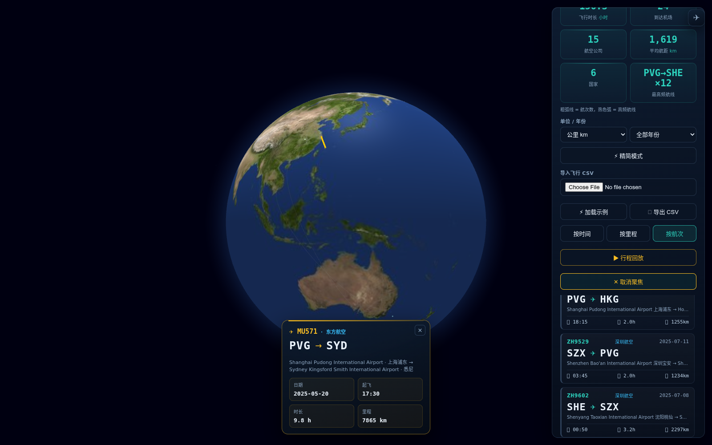
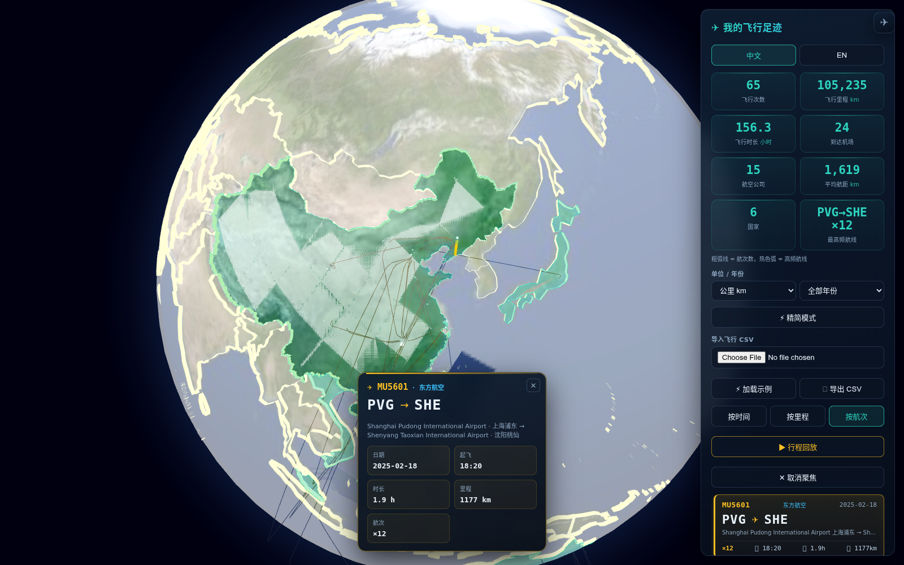

# ✈ 飞行足迹 · Flight Footprints

**Language:** [English](#english) | [中文](#chinese)

> A **100% local, privacy-first** personal flight tracker — the kind of "flight footprints" logbook popular flight-tracking apps offer, but every trajectory is imported from your own CSV and saved **only in your browser**. No server, no upload, no account.

---

## 📖 Overview

**Flight Footprints** turns your personal flight history into a beautiful, interactive 3D globe. Import a simple CSV of your flights (flight number, origin, destination, time) and instantly get a cinematic flight logbook: a chronological flight list, live statistics, airline recognition, route highlighting, an animated aircraft that flies along your selected route — and a full trip replay, all rendered on a WebGL Earth.

Your data never leaves your device. Imported flights are saved in the browser's `localStorage` and **auto-restored on your next visit** — a refresh never loses your log. Import a new CSV to replace it, or hit **✕ Clear Data** (double-confirmed) to wipe everything.

## ✨ Core Features

* **📒 Personal Flight Logbook:** A clean side panel lists every flight as a card — flight number, route (IATA ✈ IATA), date, departure time, estimated duration and distance. Sort by time or by distance.
* **🏷️ Airline Recognition:** Flight numbers are matched against a built-in IATA airline database (China Southern, Air China, China Eastern, Xiamen Air, Spring, VietJet, Jetstar, Qatar, Emirates, etc.) and shown right on the card and in the detail view.
* **📊 Live Statistics:** Total flights, total distance (km, great-circle / Haversine), total flight time, airports visited, **airlines flown** and **average distance per flight** — recomputed instantly on import.
* **🛫 Animated Aircraft:** Click any flight and a little ✈ aircraft takes off from the origin and flies along the great-circle route to the destination — looping while the route stays selected.
* **🎯 Route Highlight & Focus:** Click any flight to highlight its arc in gold, dim the rest, and smoothly fly the camera to frame that route. A detail card shows the airline, full airport names, date, duration and distance.
* **▶ Trip Replay:** Play your flights back chronologically as an animated timeline — the globe follows each leg with a flowing "aircraft" dash animation.
* **💾 Local-Only Persistence (localStorage):** Flights are saved in your browser and **auto-restored on your next visit** — a refresh never loses your log. A new import replaces it; **✕ Clear Data** (double-confirmed) wipes it for good. **Nothing is ever uploaded.**
* **🌍 Fully Offline Globe:** All libraries are vendored locally and Earth textures + 10m-resolution TopoJSON province boundaries ship with the repo. No map API keys, no network tiles, works without internet.
* **🔍 Semantic Zoom (LOD):** Airport labels and province borders fade in/out based on camera altitude.
* **🔎 Chinese / English Airport Search:** Type an IATA code, an English name, or a Chinese city name (上海, 北京, 纽约…) to jump straight to an airport.
* **🛫 Airport Route Filter:** Select any airport to display only flights departing from it, or only flights arriving at it.
* **🛠️ Classic Console:** 3D globe ⇄ 2D map projection (great-circle arcs), layer toggles, Earth auto-rotation, airport search, and high-res snapshot export (JPG).
* **⚡ Load Sample / 💾 Export CSV:** One click loads the bundled `sample.csv` to try it out, or exports your current log back to CSV as a backup.
* **⚖️ Weighted Routes:** A `weight`/`count`/`freq` column (e.g. from `compress_flights.py`) makes one row count as many flights — stats, arc thickness, replay and the CSV export all respect it.
* **🏷️ Airline Filter & Weight Sort:** Filter flights by airline (flight list + globe arcs update together, matching arcs turn violet), sort by flight count, and click the **Busiest route** stat to jump straight to that flight.
* **📥 Drag & Drop Import:** Drop any flight CSV straight onto the page to import it — no need to open the file picker.
* **📱 Installable PWA (offline-ready):** Add to home screen; core assets are cached locally so the globe still works with no network.
* **🌐 Bilingual UI:** Full Chinese / English interface.

## 🗂️ CSV Format

Minimum columns (header names are flexible & case-insensitive):

| Column | Accepted names | Example |
|--------|----------------|---------|
| Flight number | `flight_id`, `flight`, `flight_no`, `no` | `MU5601` |
| Origin (IATA) | `origin`, `origin_iata`, `from`, `dep` | `PVG` |
| Destination (IATA) | `dest`, `dest_iata`, `to`, `arr` | `SHE` |
| Departure time | `time`, `dep_time`, `departure`, `date` | `2025-02-18T10:20:00Z` |
| Flight count (weight) | `weight`, `count`, `freq` | `3` |

The optional **weight** column stands for "this route was flown N times" (e.g. a CSV produced by `compress_flights.py`). When present, statistics, arc thickness, the export and the trip replay all count weighted totals, so one row can represent many identical flights. Rows with a missing airport code or `origin == dest` are skipped automatically. See `sample.csv` for a working example — it now bundles a few `weight > 1` demo routes (hit **⚡ Load Sample**), so you can see thicker arcs, hot-colored heavy routes and `×N` badges instantly.

## 🛠️ Getting Started

1. **Start the local server:** double-click `Start_Server.bat` (runs `python -m http.server 8000` to bypass browser CORS). A browser tab opens automatically.
2. **Import your flights:** in the "✈ 我的飞行足迹" panel (right side), choose your `.csv` — or hit **⚡ 加载示例** to load the bundled sample data. Statistics and the flight list populate immediately and are saved automatically.
3. **Explore:** click a flight to watch the aircraft fly its route, hit **▶ 行程回放** for a cinematic replay, toggle 2D/3D, themes and rotation from the right console.

## ⚙️ Optional Data Tools

* `optimize_airports.py` — rebuild `airports.csv` from a raw OurAirports dump.
* `compress_flights.py` — aggregate a huge raw trajectory CSV into weighted routes, keeping a representative flight number & time (the most recent flight per route) so the compressed CSV still loads with full details; the app honors the `weight` column it produces.

## 🔒 Privacy

All flight data is processed **entirely in your browser** and stored in `localStorage` under `flightTracker.flights` (auto-restored on your next visit). There is no backend, no analytics, and no network request carrying your data. Clearing data (with confirmation) wipes both the UI and local storage.

## 🚧 Status

Actively developed. Contributions and feedback are welcome!

> **Dev note:** whenever you ship an update, bump the version in `sw.js` (currently `flight-footprints-v9`) — otherwise installed-PWA users keep serving the old cached app.

---

# ✈ 飞行足迹（纯本地 · 隐私优先）

> 一个 **100% 本地、隐私优先** 的个人飞行轨迹记录器 —— 类似常用出行 App 里的「飞行足迹」，但所有轨迹都由你从本地 CSV 导入，并且**只保存在你自己的浏览器里**。无服务器、不上传、无需账号。

## 📖 项目简介

**飞行足迹** 把你的个人飞行历史变成一颗精美的交互式 3D 地球。导入一份简单的航班 CSV（航班号、出发地、目的地、时间），即可获得一份电影感的飞行记录簿：按时间排列的航班清单、实时统计、**航空公司识别**、航线高亮动画，以及一个会**沿着选中航线飞行的小飞机** —— 全部渲染在 WebGL 地球上。

你的数据绝不离开本机。导入的航班保存在浏览器 `localStorage`，**刷新或重新打开页面都会自动恢复上次的记录**；导入新 CSV 会替换旧数据，点「✕ 清除数据」可彻底清空（带二次确认）。

## ✨ 核心功能

* **📒 个人飞行记录簿：** 右侧面板内卡片式清单展示每一程 —— 航班号、航线（IATA ✈ IATA）、日期、起飞时间、估算时长与里程。支持按时间/按里程排序。
* **🏷️ 航空公司识别：** 内置 IATA 航司数据库（南航、国航、东航、厦航、春秋、越捷、捷星、卡塔尔、阿联酋等），在卡片与详情卡上直接显示航司中文名。
* **📊 实时统计：** 飞行次数、总里程（km，大圆/Haversine）、总飞行时长、到达机场数，以及 **航空公司数** 与 **平均每程航距** —— 导入即算。
* **🛫 动态小飞机：** 点击任一航班，一架 ✈ 小飞机从出发地起飞，沿大圆航线飞往目的地，在选中期间持续往返飞行。
* **🎯 航线高亮与聚焦：** 点击任一航班，该航线金黄高亮、其余变暗，镜头平滑飞过去框住整条航线；详情卡展示航司、机场全称、日期、时长与里程。
* **▶ 行程回放：** 按时间顺序把航班逐条回放成动画时间线，地球跟随每一程，带流动的「飞机划过」虚线效果。
* **💾 纯本地持久化（localStorage）：** 航班保存在浏览器里，**下次打开自动恢复，刷新不丢数据**。导入新 CSV 会替换旧记录；「✕ 清除数据」（带二次确认）彻底清空。**绝不上传任何数据。**
* **🌍 纯离线地球：** 所有依赖库已本地化（vendored），地球贴图与 10m 级 TopoJSON 省界随仓库自带。无需地图 API Key、无网络瓦片，断网也能用。
* **🔍 智能缩放 (LOD)：** 机场标签与省界随视角高度动态显隐。
* **🔎 中英机场搜索：** 输入 IATA 代码、英文名或中文城市名（上海、北京、纽约…）即可直接跳转定位机场。
* **🛫 机场航线筛选：** 选择任意机场，可只显示从该机场起飞的航班，或只显示降落在该机场的航班。
* **🛠️ 经典控制台：** 3D 地球 ⇄ 2D 展开图（大圆航线）、图层控制、地球自转、机场搜索、高清截图导出（JPG）。
* **⚡ 加载示例 / 💾 导出 CSV：** 一键加载内置 `sample.csv` 体验，或把当前记录导出为 CSV 备份。
* **⚖️ 加权航线：** 带 `weight`/`count`/`freq` 列（如 `compress_flights.py` 生成）时，一行按 N 次航班计算——统计、航线粗细、回放与导出均尊重权重。
* **🏷️ 航司筛选 & 按航次排序：** 按航空公司筛选（航班列表与地球弧线联动，匹配航线变紫色）、按航次数排序；点击「最高频航线」统计卡可直接聚焦到该航班。
* **📥 拖放导入：** 把航班 CSV 直接拖到页面上即可导入，无需打开文件选择器。
* **📱 可安装 PWA（离线可用）：** 添加到主屏幕；核心资源本地缓存，断网也能用。
* **🌐 中英双语界面。**

## 🗂️ CSV 格式

最少需要的列（表头名灵活、不区分大小写）：

| 字段 | 可识别的列名 | 示例 |
|------|--------------|------|
| 航班号 | `flight_id`、`flight`、`flight_no`、`no` | `MU5601` |
| 出发地(IATA) | `origin`、`origin_iata`、`from`、`dep` | `PVG` |
| 目的地(IATA) | `dest`、`dest_iata`、`to`、`arr` | `SHE` |
| 起飞时间 | `time`、`dep_time`、`departure`、`date` | `2025-02-18T10:20:00Z` |
| 飞行次数(权重) | `weight`、`count`、`freq` | `3` |

可选的 **权重（weight）** 列表示「这条航线飞了 N 次」（例如 `compress_flights.py` 生成的 CSV）。带权重时，统计、航线粗细、回放与导出都按加权计算，一行可代表多条相同航线。机场代码缺失或 `起点==终点` 的行会自动跳过。完整示例见 `sample.csv`——其中已内置几条 `weight > 1` 的演示航线（点 **⚡ 加载示例**），可立即看到加粗弧线、重航线热色高亮与 `×N` 徽章。

## 🛠️ 如何运行

1. **启动本地服务：** 双击 `Start_Server.bat`（内部执行 `python -m http.server 8000` 以绕过浏览器跨域限制），浏览器会自动打开。
2. **导入航班：** 在右侧「✈ 我的飞行足迹」面板选择你的 `.csv`（或点 **⚡ 加载示例** 体验），统计与航班清单即刻生成并自动保存，下次打开自动恢复。
3. **开始探索：** 点击航班看小飞机飞完整条航线，点 **▶ 行程回放** 看电影式回放；右侧控制台可切换 2D/3D、主题与自转。

## ⚙️ 可选数据工具

* `optimize_airports.py` —— 从原始 OurAirports 数据重建 `airports.csv`。
* `compress_flights.py` —— 把庞大的原始轨迹 CSV 聚合成带权重的航线，每条保留该航线最近一次的航班号与时间作为代表（压缩后仍能完整显示航司与日期）；应用已支持按其生成的 `weight` 列显示。

## 🔒 隐私说明

所有飞行数据**完全在你的浏览器内处理**，存储在 `localStorage` 的 `flightTracker.flights` 键下（下次打开自动恢复）。没有后端、没有统计上报、没有任何携带你数据的网络请求。清除数据（带二次确认）会同时清空界面与本地存储。

## 🚧 开发状态

持续开发中，欢迎交流与贡献！

> **开发提示：** 每次发布更新时，记得同步 bump `sw.js` 里的版本号（当前为 `flight-footprints-v9`），否则已安装 PWA 的用户会继续用旧缓存。

---

## ☕ Support / 打赏

If this project helped you, you can buy me a coffee.

如果这个项目对你有帮助，可以请我喝杯咖啡。

## 📚 更多工具 More Tools

> 我做的所有免费工具与智能体都在这：[qgeng1465](https://github.com/qgeng1465) · 全部开源、本地优先、即装即用。

| 类别 | 项目 |
|---|---|
| ✈️ 可视化 | [飞行足迹 3D](https://github.com/qgeng1465/flight-trajectory-visualizer) · [TS→MP4](https://github.com/qgeng1465/ts-to-mp4-converter) · [MP4转换](https://github.com/qgeng1465/mp4-converter) · [音频工具箱](https://github.com/qgeng1465/audio-toolbox) |
| 🎬 下载 | [抖音](https://github.com/qgeng1465/douyin-watermark-free-downloader) · [B站](https://github.com/qgeng1465/bilibili-video-downloader) · [YouTube](https://github.com/qgeng1465/youtube-downloader) · [小红书](https://github.com/qgeng1465/xiaohongshu-downloader) · [公众号](https://github.com/qgeng1465/wechat-article-exporter) · [直播录制](https://github.com/qgeng1465/LiveRecorder) |
| 🧬 AI 智能体 | [AI4Bio](https://github.com/qgeng1465/ai4bio-agents) · [AI4Chem](https://github.com/qgeng1465/ai4chem-agents) · [AI4科研](https://github.com/qgeng1465/ai4research-agents) · [日常生活](https://github.com/qgeng1465/daily-agents) |

