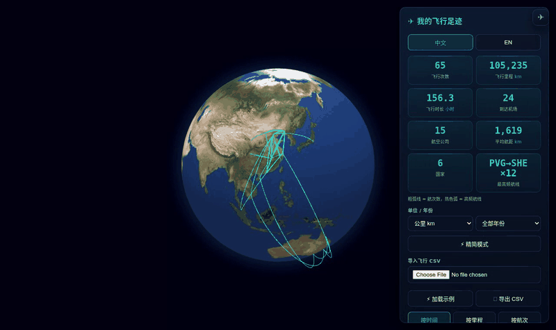

# ✈ 飞行足迹 · Flight Footprints

**Language:** [English](#english) | [中文](#chinese)

> **💡 一句话介绍：** 把你的飞行历史变成 3D 地球上的绚丽足迹 —— 100% 本地、零上传、无账号，单 HTML 文件即开即用。

> **A privacy-first flight tracker.** Import your flight CSV → get a cinematic 3D globe logbook. All data stays in your browser. No server. No account. [Try it live →](https://qgeng1465.github.io/flight-trajectory-visualizer/)

---

> **▶ Full demo video (36 s):** [`demo.webm`](demo.webm) — importing a log, the animated aircraft, trip replay and the ranked airport search, recorded from the live app. The GIF above is the same clip sped up to fit under 6 MB.

📸 更多截图 / More screenshots

**Footprints on the globe · 全球足迹**

**Flight list, statistics and airline filter · 航班清单与统计**

**Route focus with the animated aircraft · 航线聚焦**

---

## 📖 Overview

**

**

**Flight Footprints** turns your personal flight history into a beautiful, interactive 3D globe. Import a simple CSV of your flights (flight number, origin, destination, time) and instantly get a cinematic flight logbook: a chronological flight list, live statistics, airline recognition, route highlighting, an animated aircraft that flies along your selected route — and a full trip replay, all rendered on a WebGL Earth.

Your data never leaves your device. Imported flights are saved in the browser's `localStorage` and **auto-restored on your next visit** — a refresh never loses your log. A new CSV is **merged into** what you already have and **de-duplicated** (same flight number, route and time = one entry), so you can import your history a chunk at a time; hit **✕ Clear Data** (double-confirmed) first if you want to replace the log outright.

### 🚀 Quick Start (30 seconds)

1. **Download** or clone this repo
2. **Start the local server** — double-click `Start_Server.bat` (Windows) or run `./start_server.sh` (macOS / Linux). Both just run `python -m http.server`; any static server works. Then open <http://localhost:8000>.
3. **Click** ⚡ Load Sample to see it in action
4. **Import** your own CSV (see format below) and watch your flights come to life

That's it — no npm install, no build, no backend. Just you and your flight data on your machine.

> **⚠️ Don't just double-click `index.html`.** Browsers block a page opened from disk (`file://`) from reading `airports.csv`, so search and the sample data would not work. The app detects this and tells you what to do, but starting the server is the fix. The server binds to `127.0.0.1` only, so your flight log is never exposed to the network.

**Flight Footprints** turns your personal flight history into a beautiful, interactive 3D globe. Import a simple CSV of your flights (flight number, origin, destination, time) and instantly get a cinematic flight logbook: a chronological flight list, live statistics, airline recognition, route highlighting, an animated aircraft that flies along your selected route — and a full trip replay, all rendered on a WebGL Earth.

Your data never leaves your device. Imported flights are saved in the browser's `localStorage` and **auto-restored on your next visit** — a refresh never loses your log. A new CSV is **merged into** what you already have and **de-duplicated** (same flight number, route and time = one entry), so you can import your history a chunk at a time; hit **✕ Clear Data** (double-confirmed) first if you want to replace the log outright.

## ✨ Core Features

* **📒 Personal Flight Logbook:** A clean side panel lists every flight as a card — flight number, route (IATA ✈ IATA), date, departure time, estimated duration and distance. Sort by time or by distance.
* **🏷️ Airline Recognition:** Flight numbers are matched against a built-in IATA airline database (China Southern, Air China, China Eastern, Xiamen Air, Spring, VietJet, Jetstar, Qatar, Emirates, etc.) and shown right on the card and in the detail view.
* **📊 Live Statistics:** Total flights, total distance (km, great-circle / Haversine), total flight time, airports visited, **airlines flown** and **average distance per flight** — recomputed instantly on import.
* **🌍 Visited-Country Footprints:** A **Countries** stat counts how many countries / regions your flights touched; hover it to see the full list, and every visited place glows teal on the globe. Country attribution is keyed off OurAirports' own ISO codes, so France, Norway and Kosovo are counted as themselves instead of collapsing into a single bogus `-99` bucket.
* **📏 km ⇄ mi Toggle:** Switch every distance between kilometres and miles (stats, flight list, share card) — remembered between visits.
* **🕐 Timezone-Aware Times:** A `tz` column (IANA name like `Asia/Shanghai` or an offset like `+08:00`) makes each flight show its correct local date & time; without it, flights fall back to your browser's local time.
* **📅 Year View:** Filter by year and read one line — *My 2025 — N flights · X km · Y countries*.
* **📤 Share Card:** One click renders a 1080×1350 share image (your footprint globe + total distance + countries + airlines) to post on WeChat Moments / Xiaohongshu.
* **⚡ Lite Mode:** For weak laptops — hides the glow, the plane animation, animated arcs and country borders, keeping just cities + routes for smooth sailing; auto-enables on low-core / low-memory devices.
* **🛫 Animated Aircraft:** Click any flight and a little ✈ aircraft takes off from the origin and flies the route to the destination — looping while the route stays selected.
* **🛬 Altitude Profiles:** Routes are drawn as climb–cruise–descent profiles rather than flat hoops — both ends come down to the surface, the climb/descent are given 18 and 24 minutes, and the cruise height scales with the great-circle distance, so a short hop and a long-haul arch to visibly different heights. The aircraft flies that same profile, not a fixed height above the globe.
* **🎯 Route Highlight & Focus:** Click any flight to highlight its arc in gold, dim the rest, and smoothly fly the camera to frame that route. A detail card shows the airline, full airport names, date, duration and distance.
* **▶ Trip Replay:** Play your flights back chronologically as an animated timeline — the globe follows each leg with a flowing "aircraft" dash animation.
* **💾 Local-Only Persistence (localStorage):** Flights are saved in your browser and **auto-restored on your next visit** — a refresh never loses your log. New imports are **merged and de-duplicated** into the existing log (add as many CSVs as you like — overlapping rows are skipped and reported); **✕ Clear Data** (double-confirmed) wipes it for good. **Nothing is ever uploaded.**
* **🌍 Fully Offline Globe:** All libraries are vendored locally and Earth textures + 10m-resolution TopoJSON province boundaries ship with the repo. No map API keys, no network tiles, works without internet.
* **🔍 Semantic Zoom (LOD):** Airport labels and province borders fade in/out based on camera altitude.
* **🔎 Smart Airport Search:** Type an IATA code, an English name, a **city** (New York, Paris, Sydney…), a local-language keyword (München, 東京) or a Chinese name (上海, 北京, 纽约…). Results are **ranked by relevance** (exact code → code prefix → exact city → city/name prefix → keyword), matched text is **highlighted**, cities are shown next to each airport, and **↑ / ↓ / Enter / Esc** drive the list without touching the mouse.
* **🛫 Airport Route Filter:** Select any airport to display only flights departing from it, or only flights arriving at it.
* **🛠️ Classic Console:** 3D globe ⇄ 2D map projection (great-circle arcs), layer toggles, Earth auto-rotation, airport search, and high-res snapshot export (JPG).
* **⚡ Load Sample / 💾 Export CSV:** One click loads the bundled `sample.csv` to try it out, or exports your current log back to CSV as a backup.
* **⚖️ Weighted Routes:** A `weight`/`count`/`freq` column (e.g. from `compress_flights.py`) makes one row count as many flights — stats, arc thickness, replay and the CSV export all respect it.
* **🏷️ Airline Filter & Weight Sort:** Filter flights by airline (flight list + globe arcs update together, matching arcs turn violet), sort by flight count, and click the **Busiest route** stat to jump straight to that flight.
* **📥 Drag & Drop Import:** Drop any flight CSV straight onto the page to import it — no need to open the file picker.
* **📱 Installable PWA (offline-ready):** Add to home screen; core assets are cached locally so the globe still works with no network.
* **🎨 Dual Themes:** Satellite color or a minimal dark palette — arc colors, glow and the 2D map background follow your choice and are remembered between visits.
* **🌐 Bilingual UI:** Full Chinese / English interface.

## 🗂️ CSV Format

Minimum columns (header names are flexible & case-insensitive):

| Column | Accepted names | Example |
|--------|----------------|---------|
| Flight number | `flight_id`, `flight`, `flight_no`, `no` | `MU5601` |
| Origin (IATA) | `origin`, `origin_iata`, `from`, `dep` | `PVG` |
| Destination (IATA) | `dest`, `dest_iata`, `to`, `arr` | `SHE` |
| Departure time | `time`, `dep_time`, `departure`, `date` | `2025-02-18T10:20:00Z` |
| Timezone (optional) | `tz`, `timezone`, `time_zone` | `Asia/Shanghai` or `+08:00` |
| Flight count (weight) | `weight`, `count`, `freq` | `3` |

The optional **weight** column stands for "this route was flown N times" (e.g. a CSV produced by `compress_flights.py`). When present, statistics, arc thickness, the export and the trip replay all count weighted totals, so one row can represent many identical flights. Rows with a missing airport code or `origin == dest` are skipped automatically. See `sample.csv` for a working example — it bundles a few `weight > 1` demo routes plus a few international legs (Shanghai→Sydney, Beijing→Tokyo Haneda, Shanghai→Hong Kong), so you can see thicker arcs, hot-colored heavy routes and `×N` badges instantly (hit **⚡ Load Sample**).

### 🗺️ Importing from MyFlightradar24 / TripIt

**MyFlightradar24** — its **Export CSV** needs no renaming:

| myFR24 column | App field |
|---|---|
| `FlightDate` | date |
| `Origin` | origin (IATA) |
| `Destination` | dest (IATA) |
| `FlightNo` | flight number |

**TripIt**-style exports (API / most importers) use these common columns — all recognized directly:

| TripIt column | App field |
|---|---|
| `DepartureDate` (or `DepartureDateTime`; a separate `DepartureTime` is merged in automatically) | date & time |
| `Origin` / `OriginAirport` / `DepartureAirport` | origin (IATA) |
| `Destination` / `DestinationAirport` / `ArrivalAirport` | dest (IATA) |
| `FlightNumber` | flight number |

Header matching is **scored, not exact**, and case-insensitive: `OriginAirport` counts the same as `origin`, `DepartureDate` is taken as the date even when the file also carries a `DepartureTime`, and a lone `Departure` column is never mistaken for an airport. Columns the names don't settle are then recovered from their *values* — a column of IATA codes that exist in the bundled airport database, of ISO-style timestamps, or of flight numbers. That is what makes an export with headers we've never seen import unchanged: another tool's naming (`c1`, `c2`, `c3`), a non-English column set (`Sortie`, `Arrivee`, `Vol`, `Quand`), or a header pair that looks ambiguous. Those five awkward header sets — plus the bundled `sample.csv` — are in [`tests/fixtures/`](tests/fixtures/); each is two flights between PVG/SHE and PEK/CAN, so you can drop any of them into the app and watch it resolve.

Only **IATA airport codes** are matched (e.g. `PVG`, `SHE`) — if your export contains airport *names* instead of codes, swap in a code column.

## 🛠️ Getting Started

1. **Start the local server:** double-click `Start_Server.bat` on Windows, or run `./start_server.sh` on macOS / Linux (both run `python -m http.server 8000`; add a port as the first argument to change it). A browser tab opens automatically. Any other static server — `npx serve`, VS Code Live Server — works just as well.
2. **Import your flights:** in the "✈ 我的飞行足迹" panel (right side), choose your `.csv` — or hit **⚡ 加载示例** to load the bundled sample data. Statistics and the flight list populate immediately and are saved automatically.
3. **Explore:** click a flight to watch the aircraft fly its route, hit **▶ 行程回放** for a cinematic replay, toggle 2D/3D, themes and rotation from the right console.

## ⚙️ Optional Data Tools

* `enrich_countries.py` — the rebuild that produces the **bundled** data: joins OurAirports `airports.csv` + `countries.csv` onto Natural Earth 110m/10m geometry, emitting `airports.csv` (IATA, name, coordinates, type, English + Chinese country name, ISO, city, search keywords) and `countries.geojson`. It keeps large & medium airports **plus small airports that have scheduled passenger service**, and reads Natural Earth's `ISO_A2_EH` column so France / Norway / Kosovo get their real codes instead of `-99`.
* `optimize_airports.py` — minimal IATA-only rebuild of `airports.csv` from a raw OurAirports dump.
* `compress_flights.py` — aggregate a huge raw trajectory CSV into weighted routes, keeping a representative flight number & time (the most recent flight per route) so the compressed CSV still loads with full details; the app honors the `weight` column it produces.

## 🔒 Privacy

All flight data is processed **entirely in your browser** and stored in `localStorage` under `flightTracker.flights` (auto-restored on your next visit). There is no backend, no analytics, and no network request carrying your data. Clearing data (with confirmation) wipes both the UI and local storage.

## 🤝 Contributing

Contributions of all kinds are welcome! Feel free to:

- **Report bugs** via [GitHub Issues](https://github.com/qgeng1465/flight-trajectory-visualizer/issues)
- **Suggest features** (year view, more import formats, new visualizations, etc.)
- **Improve docs** (README, comments, code examples)
- **Submit PRs** (bug fixes, new features, performance optimizations)

This project is written in vanilla JS with zero dependencies beyond the vendored libraries — PRs should keep it lightweight and local-only.

## 📄 License

[MIT License](LICENSE) — **for academic and personal use only.** Commercial use is not permitted. Attribution is appreciated.

## 🚧 Status

Actively developed. Contributions and feedback are welcome!

> **Dev note:** whenever you ship an update, bump the version in `sw.js` (currently `flight-footprints-v17`) — otherwise installed-PWA users keep serving the old cached app.

---

# ✈ 飞行足迹（纯本地 · 隐私优先）

> **💡 一句话介绍：** 把你的飞行历史变成 3D 地球上的绚丽足迹 —— 100% 本地、零上传、无账号，单 HTML 文件即开即用。

一个 **100% 本地、隐私优先** 的个人飞行轨迹记录器 —— 类似常用出行 App 里的「飞行足迹」，但所有轨迹都由你从本地 CSV 导入，并且**只保存在你自己的浏览器里**。无服务器、不上传、无需账号。

## 📖 项目简介

**

**

**飞行足迹** 把你的个人飞行历史变成一颗精美的交互式 3D 地球。导入一份简单的航班 CSV（航班号、出发地、目的地、时间），即可获得一份电影感的飞行记录簿：按时间排列的航班清单、实时统计、**航空公司识别**、航线高亮动画，以及一个会**沿着选中航线飞行的小飞机** —— 全部渲染在 WebGL 地球上。

你的数据绝不离开本机。导入的航班保存在浏览器 `localStorage`，**刷新或重新打开页面都会自动恢复上次的记录**；导入新 CSV 会**并入**已有记录并**自动去重**（航班号、航线、时间都相同即视为同一条），可以分多次导入；想整份替换，先点「✕ 清除数据」再导入即可。

### 🚀 三步上手（30 秒）

1. **下载** 或克隆本项目
2. **启动本地服务** —— Windows 双击 `Start_Server.bat`，macOS / Linux 运行 `./start_server.sh`（两者都只是执行 `python -m http.server`；任何静态服务器都可以）。然后打开 <http://localhost:8000>。
3. **点击** ⚡ 加载示例 体验效果
4. **导入** 你的 CSV（见下方格式）即可点亮你的飞行足迹

就这些 —— 无需 npm install，无需构建，无需后端。只是你和你的飞行数据，在本机运行。

> **⚠️ 不要直接双击 `index.html`。** 浏览器不允许 `file://` 打开的页面读取 `airports.csv`，搜索和示例数据都会失效。应用会检测到这种情况并给出提示，但正确的做法就是起一个本地服务。该服务只监听 `127.0.0.1`，你的飞行记录不会被暴露到网络上。

**飞行足迹** 把你的个人飞行历史变成一颗精美的交互式 3D 地球。导入一份简单的航班 CSV（航班号、出发地、目的地、时间），即可获得一份电影感的飞行记录簿：按时间排列的航班清单、实时统计、**航空公司识别**、航线高亮动画，以及一个会**沿着选中航线飞行的小飞机** —— 全部渲染在 WebGL 地球上。

你的数据绝不离开本机。导入的航班保存在浏览器 `localStorage`，**刷新或重新打开页面都会自动恢复上次的记录**；导入新 CSV 会**并入**已有记录并**自动去重**（航班号、航线、时间都相同即视为同一条），可以分多次导入；想整份替换，先点「✕ 清除数据」再导入即可。

## ✨ 核心功能

* **📒 个人飞行记录簿：** 右侧面板内卡片式清单展示每一程 —— 航班号、航线（IATA ✈ IATA）、日期、起飞时间、估算时长与里程。支持按时间/按里程排序。
* **🏷️ 航空公司识别：** 内置 IATA 航司数据库（南航、国航、东航、厦航、春秋、越捷、捷星、卡塔尔、阿联酋等），在卡片与详情卡上直接显示航司中文名。
* **📊 实时统计：** 飞行次数、总里程（km，大圆/Haversine）、总飞行时长、到达机场数，以及 **航空公司数** 与 **平均每程航距** —— 导入即算。
* **🌍 足迹国家统计：** 新增「国家」统计卡，显示你的足迹到过多少个国家/地区；悬停可看完整名单，到过的国家/地区在地球上以青绿色高亮。国家归属以 OurAirports 的 ISO 代码为准，法国、挪威、科索沃会各自计数，不会再一起掉进一个错误的 `-99` 桶里。
* **📏 公里 / 英里切换：** 一键把里程单位在 km / mi 之间切换（统计、航班列表、分享卡同步），并记住你的选择。
* **🕐 时区感知：** 支持 `tz` 列（如 `Asia/Shanghai` 或 `+08:00`），让每一程显示正确的当地时间；未提供时区时自动回退到浏览器本地时间。
* **📅 年度视图：** 按年份筛选，一行看清「我的 2025 —— N 次飞行 · X km · Y 个国家」。
* **📤 分享足迹卡：** 一键生成 1080×1350 分享图片（足迹地球 + 总里程 + 国家数 + 航司数），保存后可直接发朋友圈 / 小红书。
* **⚡ 精简模式：** 弱笔记本福音——隐藏光晕、小飞机动画、动态航线与国界，只保留城市与航线，丝般顺滑；低配设备自动开启。
* **🛫 动态小飞机：** 点击任一航班，一架 ✈ 小飞机从出发地起飞，沿航线飞往目的地，在选中期间持续往返飞行。
* **🛬 高度剖面航线：** 航线按「爬升—巡航—下降」绘制，而不是等高的弧：起降两端落回地面，爬升/下降各按 18 / 24 分钟展开，巡航高度随大圆距离缩放——短程与长程的拱高一眼可辨。小飞机沿同一条剖面飞行，不再是贴着地球的固定高度。
* **🎯 航线高亮与聚焦：** 点击任一航班，该航线金黄高亮、其余变暗，镜头平滑飞过去框住整条航线；详情卡展示航司、机场全称、日期、时长与里程。
* **▶ 行程回放：** 按时间顺序把航班逐条回放成动画时间线，地球跟随每一程，带流动的「飞机划过」虚线效果。
* **💾 纯本地持久化（localStorage）：** 航班保存在浏览器里，**下次打开自动恢复，刷新不丢数据**。导入新 CSV 会**并入并去重**到现有记录（可反复导入，重复行自动跳过并提示）；「✕ 清除数据」（带二次确认）彻底清空。**绝不上传任何数据。**
* **🌍 纯离线地球：** 所有依赖库已本地化（vendored），地球贴图与 10m 级 TopoJSON 省界随仓库自带。无需地图 API Key、无网络瓦片，断网也能用。
* **🔍 智能缩放 (LOD)：** 机场标签与省界随视角高度动态显隐。
* **🔎 智能机场搜索：** 支持 IATA 代码、英文名、**城市名**（纽约、巴黎、悉尼…）、本地语言关键词（München、東京）与中文名（上海、北京、纽约…）。结果**按相关度排序**（代码完全匹配 → 代码前缀 → 城市完全匹配 → 城市/机场名前缀 → 关键词），命中文字**高亮**显示，机场旁标出所在城市，并可用 **↑ / ↓ / Enter / Esc** 全键盘选择。
* **🛫 机场航线筛选：** 选择任意机场，可只显示从该机场起飞的航班，或只显示降落在该机场的航班。
* **🛠️ 经典控制台：** 3D 地球 ⇄ 2D 展开图（大圆航线）、图层控制、地球自转、机场搜索、高清截图导出（JPG）。
* **⚡ 加载示例 / 💾 导出 CSV：** 一键加载内置 `sample.csv` 体验，或把当前记录导出为 CSV 备份。
* **⚖️ 加权航线：** 带 `weight`/`count`/`freq` 列（如 `compress_flights.py` 生成）时，一行按 N 次航班计算——统计、航线粗细、回放与导出均尊重权重。
* **🏷️ 航司筛选 & 按航次排序：** 按航空公司筛选（航班列表与地球弧线联动，匹配航线变紫色）、按航次数排序；点击「最高频航线」统计卡可直接聚焦到该航班。
* **📥 拖放导入：** 把航班 CSV 直接拖到页面上即可导入，无需打开文件选择器。
* **📱 可安装 PWA（离线可用）：** 添加到主屏幕；核心资源本地缓存，断网也能用。
* **🎨 双主题：** 卫星遥感或极简暗色——弧线、光晕与 2D 地图底色随主题切换，并记住你的选择。
* **🌐 中英双语界面。**

## 🗂️ CSV 格式

最少需要的列（表头名灵活、不区分大小写）：

| 字段 | 可识别的列名 | 示例 |
|------|--------------|------|
| 航班号 | `flight_id`、`flight`、`flight_no`、`no` | `MU5601` |
| 出发地(IATA) | `origin`、`origin_iata`、`from`、`dep` | `PVG` |
| 目的地(IATA) | `dest`、`dest_iata`、`to`、`arr` | `SHE` |
| 起飞时间 | `time`、`dep_time`、`departure`、`date` | `2025-02-18T10:20:00Z` |
| 时区(可选) | `tz`、`timezone`、`time_zone` | `Asia/Shanghai` 或 `+08:00` |
| 飞行次数(权重) | `weight`、`count`、`freq` | `3` |

可选的 **权重（weight）** 列表示「这条航线飞了 N 次」（例如 `compress_flights.py` 生成的 CSV）。带权重时，统计、航线粗细、回放与导出都按加权计算，一行可代表多条相同航线。机场代码缺失或 `起点==终点` 的行会自动跳过。完整示例见 `sample.csv`——内置几条 `weight > 1` 的演示航线，并含上海→悉尼、北京→东京、上海→香港等国际航段（点 **⚡ 加载示例**），可立即看到加粗弧线、重航线热色高亮、`×N` 徽章与中文机场名。

### 🗺️ 从 MyFlightradar24 / TripIt 导入

**MyFlightradar24** —— 其「导出 CSV」几乎可以直接用，无需改名：

| myFR24 列 | 应用字段 |
|---|---|
| `FlightDate` | 日期 |
| `Origin` | 出发地 (IATA) |
| `Destination` | 目的地 (IATA) |
| `FlightNo` | 航班号 |

**TripIt** 风格导出（API / 多数导入器）常用以下列，均直接识别：

| TripIt 列 | 应用字段 |
|---|---|
| `DepartureDate`（或 `DepartureDateTime`；单独的 `DepartureTime` 会自动合并） | 日期与时间 |
| `Origin` / `OriginAirport` / `DepartureAirport` | 出发地 (IATA) |
| `Destination` / `DestinationAirport` / `ArrivalAirport` | 目的地 (IATA) |
| `FlightNumber` | 航班号 |

表头匹配是**打分制、不是精确比对**，且不区分大小写：`OriginAirport` 与 `origin` 同分，`DepartureDate` 在有 `DepartureTime` 的文件里仍被认作日期，单写一个 `Departure` 也不会被误当成机场。名字定不下来的列，再按**列里的值**兜底识别——一列真实存在于内置机场库的 IATA 代码、一列 ISO 风格的时间戳、或一列航班号。正因如此，从没见过的表头也能原样导入：别的工具的命名（`c1`、`c2`、`c3`）、非英文列名（`Sortie`、`Arrivee`、`Vol`、`Quand`）、看起来有歧义的列名组合。这五种表头（外加内置 `sample.csv`）都放在 [`tests/fixtures/`](tests/fixtures/) 里，每份都是 PVG/SHE 与 PEK/CAN 两趟航班，直接拖进应用即可看到识别结果。

应用只按 **IATA 机场代码**匹配（如 `PVG`、`SHE`）——如果导出的是机场*名称*，请替换为代码列。

## 🛠️ 如何运行

1. **启动本地服务：** Windows 双击 `Start_Server.bat`，macOS / Linux 运行 `./start_server.sh`（两者内部都执行 `python -m http.server 8000`；首个参数可指定端口），浏览器会自动打开。其它静态服务器（`npx serve`、VS Code Live Server 等）同样可用。
2. **导入航班：** 在右侧「✈ 我的飞行足迹」面板选择你的 `.csv`（或点 **⚡ 加载示例** 体验），统计与航班清单即刻生成并自动保存，下次打开自动恢复。
3. **开始探索：** 点击航班看小飞机飞完整条航线，点 **▶ 行程回放** 看电影式回放；右侧控制台可切换 2D/3D、主题与自转。

## ⚙️ 可选数据工具

* `enrich_countries.py` —— 生成仓库内**内置数据**的脚本：把 OurAirports 的 `airports.csv` + `countries.csv` 关联到 Natural Earth 110m/10m 几何，产出 `airports.csv`（IATA、名称、经纬度、类型、英文/中文国家名、ISO、城市、搜索关键词）与 `countries.geojson`。保留大/中型机场，**并额外保留有定期客运航班的小型机场**；国家代码读取 Natural Earth 的 `ISO_A2_EH` 列，因此法国/挪威/科索沃拿到的是真实代码而非 `-99`。
* `optimize_airports.py` —— 仅保留 IATA 代码的极简重建脚本，从原始 OurAirports 数据生成 `airports.csv`。
* `compress_flights.py` —— 把庞大的原始轨迹 CSV 聚合成带权重的航线，每条保留该航线最近一次的航班号与时间作为代表（压缩后仍能完整显示航司与日期）；应用已支持按其生成的 `weight` 列显示。

## 🔒 隐私说明

所有飞行数据**完全在你的浏览器内处理**，存储在 `localStorage` 的 `flightTracker.flights` 键下（下次打开自动恢复）。没有后端、没有统计上报、没有任何携带你数据的网络请求。清除数据（带二次确认）会同时清空界面与本地存储。

## 🤝 贡献指南

欢迎各种形式的贡献！你可以：

- **报告 bug** 通过 [GitHub Issues](https://github.com/qgeng1465/flight-trajectory-visualizer/issues)
- **建议功能**（年度视图、更多导入格式、新可视化等）
- **改进文档**（README、注释、代码示例）
- **提交 PR**（bug 修复、新功能、性能优化）

本项目用原生 JS 编写，除已内嵌的库外零依赖 —— 请保持轻量和纯本地。

## 📄 开源许可

[MIT License](LICENSE) —— **仅限学术和个人使用**，不得用于商业用途。署名感谢但非强制。

## 🚧 开发状态

持续开发中，欢迎交流与贡献！

> **开发提示：** 每次发布更新时，记得同步 bump `sw.js` 里的版本号（当前为 `flight-footprints-v17`），否则已安装 PWA 的用户会继续用旧缓存。

---

## ☕ Support / 打赏

If this project helped you, you can buy me a coffee.

如果这个项目对你有帮助，可以请我喝杯咖啡。

## 📚 更多工具 More Tools

> 我做的所有免费工具与智能体都在这：[qgeng1465](https://github.com/qgeng1465) · 全部开源、本地优先、即装即用。

| 类别 | 项目 |
|---|---|
| ✈️ 可视化 | [飞行足迹 3D](https://github.com/qgeng1465/flight-trajectory-visualizer) · [TS→MP4](https://github.com/qgeng1465/ts-to-mp4-converter) · [MP4转换](https://github.com/qgeng1465/mp4-converter) · [音频工具箱](https://github.com/qgeng1465/audio-toolbox) |
| 🎬 下载 | [抖音](https://github.com/qgeng1465/douyin-watermark-free-downloader) · [B站](https://github.com/qgeng1465/bilibili-video-downloader) · [YouTube](https://github.com/qgeng1465/youtube-downloader) · [小红书](https://github.com/qgeng1465/xiaohongshu-downloader) · [公众号](https://github.com/qgeng1465/wechat-article-exporter) · [直播录制](https://github.com/qgeng1465/LiveRecorder) |
| 🧬 AI 智能体 | [AI4Bio](https://github.com/qgeng1465/ai4bio-agents) · [AI4Chem](https://github.com/qgeng1465/ai4chem-agents) · [AI4科研](https://github.com/qgeng1465/ai4research-agents) · [日常生活](https://github.com/qgeng1465/daily-agents) |

