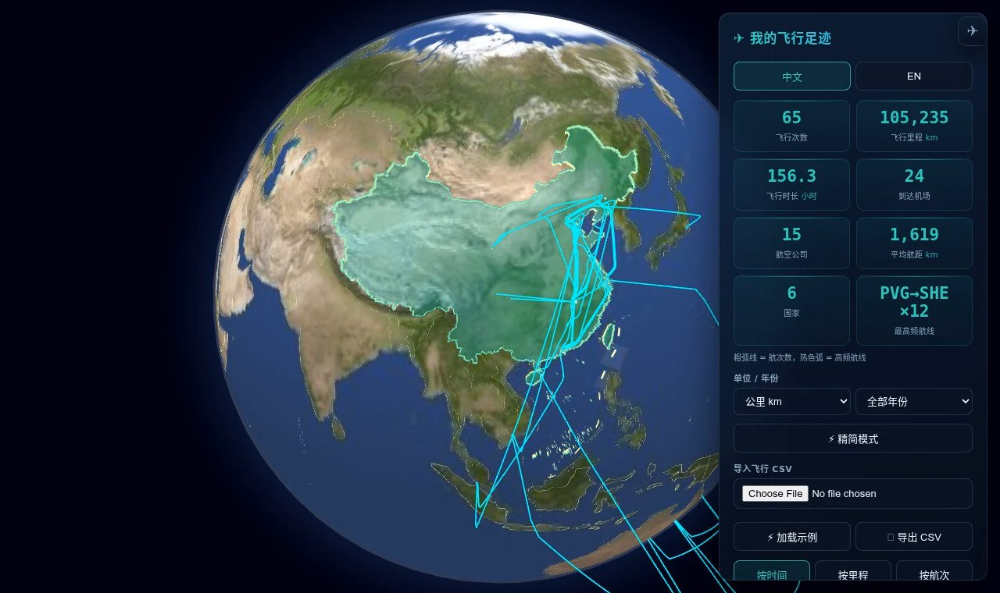
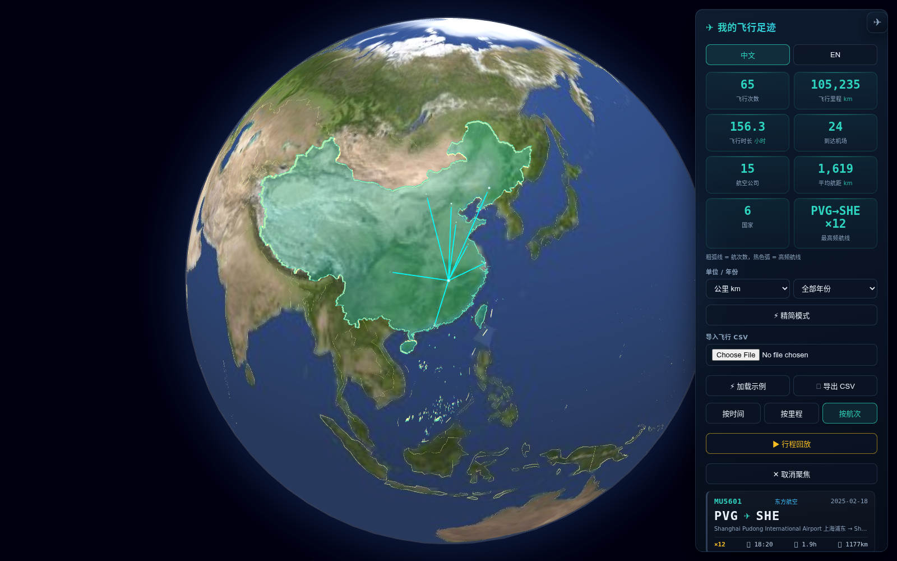
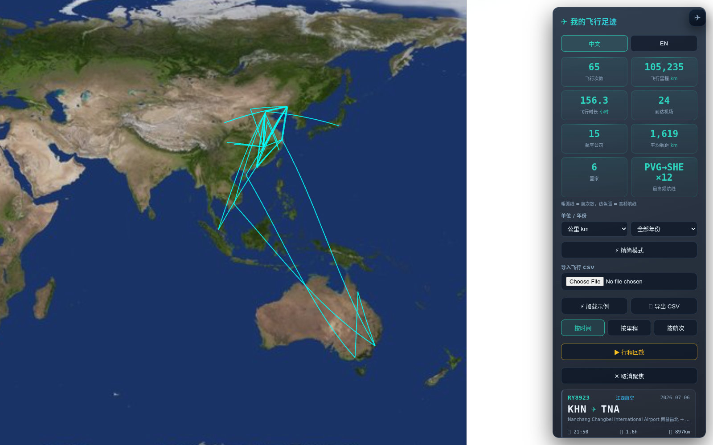
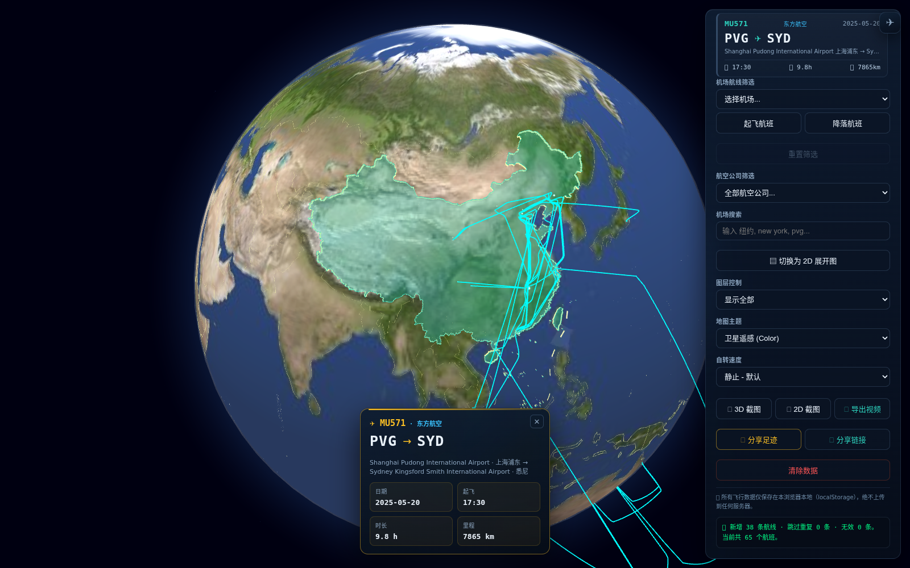
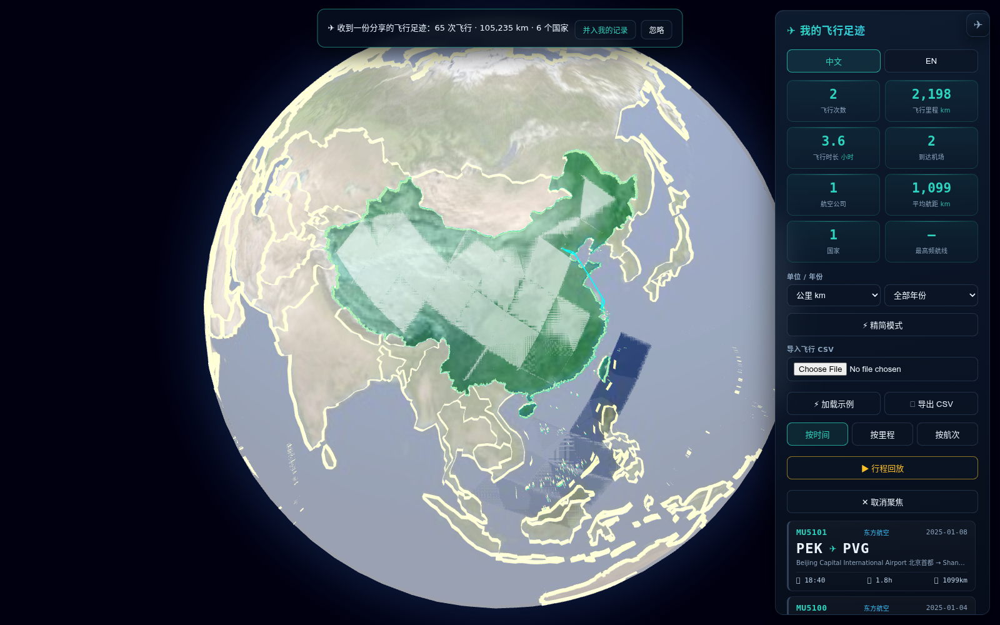

# ✈ 飞行足迹（纯本地 · 隐私优先）

<!-- README-I18N:START -->
[English](./README.md) | **汉语**
<!-- README-I18N:END -->

> **💡 一句话介绍：** 把你的飞行历史变成 3D 地球上的绚丽足迹 —— 100% 本地、零上传、无账号，单 HTML 文件即开即用。

---

> **▶ 演示视频（36 秒）：** [**在浏览器里播放 →**](https://qgeng1465.github.io/flight-trajectory-visualizer/demo.html) — MP4（2.9 MB）+ WebM（3.9 MB），1280×760，点封面图同样可以打开。收录了导入日志、飞机沿高度剖面飞行、行程回放，以及按评分排序的机场搜索。文件本身是 [`demo.mp4`](demo.mp4) 和 [`demo.webm`](demo.webm)；上面的链接打开的是一个带真正播放器的页面。

---

一个 **100% 本地、隐私优先** 的个人飞行轨迹记录器 —— 类似常用出行 App 里的「飞行足迹」，但所有轨迹都由你从本地 CSV 导入，并且**只保存在你自己的浏览器里**。无服务器、不上传、无需账号。

## 📸 界面截图

下面每一张都是应用的真实截图，取自当前发布的版本。

| 全球足迹 | 航班清单与统计 |
|:---:|:---:|
|  |  |

| 航线聚焦 —— 小飞机沿高度剖面飞行 | 机场筛选 —— 某个枢纽的全部出发航班 |
|:---:|:---:|
|  |  |

| 2D 展开图（仅显示航线） | 导出与分享按钮 |
|:---:|:---:|
|  |  |

> 2D 图关掉了机场标签（图层控制选「仅显示航线」）—— 全球视角下标签会叠成一团，关掉之后航线网络才看得清。

**收到别人分享的链接时** —— 在你确认之前，不会碰到你自己的记录。

## 📖 项目简介

**

**

**飞行足迹** 把你的个人飞行历史变成一颗精美的交互式 3D 地球。导入一份简单的航班 CSV（航班号、出发地、目的地、时间），即可获得一份电影感的飞行记录簿：按时间排列的航班清单、实时统计、**航空公司识别**、航线高亮动画，以及一个会**沿着选中航线飞行的小飞机** —— 全部渲染在 WebGL 地球上。

你的数据绝不离开本机。导入的航班保存在浏览器 `localStorage`，**刷新或重新打开页面都会自动恢复上次的记录**；导入新 CSV 会**并入**已有记录并**自动去重**（航班号、航线、时间都相同即视为同一条），可以分多次导入；想整份替换，先点「✕ 清除数据」再导入即可。

### 🚀 三步上手（30 秒）

1. **下载** 或克隆本项目
2. **启动本地服务** —— Windows 双击 `Start_Server.bat`，macOS / Linux 运行 `./start_server.sh`（两者都只是执行 `python -m http.server`；任何静态服务器都可以）。然后打开 <http://localhost:8000>。
3. **点击** ⚡ 加载示例 体验效果
4. **导入** 你的 CSV（见下方格式）即可点亮你的飞行足迹

就这些 —— 无需 npm install，无需构建，无需后端。只是你和你的飞行数据，在本机运行。

> **⚠️ 不要直接双击 `index.html`。** 浏览器不允许 `file://` 打开的页面读取 `airports.csv`，搜索和示例数据都会失效。应用会检测到这种情况并给出提示，但正确的做法就是起一个本地服务。该服务只监听 `127.0.0.1`，你的飞行记录不会被暴露到网络上。

## ✨ 核心功能

* **📒 个人飞行记录簿：** 右侧面板内卡片式清单展示每一程 —— 航班号、航线（IATA ✈ IATA）、日期、起飞时间、估算时长与里程。支持按时间/按里程排序。
* **🏷️ 航空公司识别：** 内置 IATA 航司数据库（南航、国航、东航、厦航、春秋、越捷、捷星、卡塔尔、阿联酋等），在卡片与详情卡上直接显示航司中文名。
* **📊 实时统计：** 飞行次数、总里程（km，大圆/Haversine）、总飞行时长、到达机场数，以及 **航空公司数** 与 **平均每程航距** —— 导入即算。
* **🌍 足迹国家统计：** 新增「国家」统计卡，显示你的足迹到过多少个国家/地区；悬停可看完整名单，到过的国家/地区在地球上以青绿色高亮。国家归属以 OurAirports 的 ISO 代码为准，法国、挪威、科索沃会各自计数，不会再一起掉进一个错误的 `-99` 桶里。
* **📏 公里 / 英里切换：** 一键把里程单位在 km / mi 之间切换（统计、航班列表、分享卡同步），并记住你的选择。
* **🕐 时区感知：** 支持 `tz` 列（如 `Asia/Shanghai` 或 `+08:00`），让每一程显示正确的当地时间；未提供时区时自动回退到浏览器本地时间。
* **📅 年度视图：** 按年份筛选，一行看清「我的 2025 —— N 次飞行 · X km · Y 个国家」。
* **📤 分享足迹卡：** 一键生成 1080×1350 分享图片（足迹地球 + 总里程 + 国家数 + 航司数），保存后可直接发朋友圈 / 小红书。
* **🎬 导出视频：** 点 **🎬 导出视频**，浏览器会录下地球——14 秒，绕你的足迹转一圈，最后推近到航线——并下载为 `.webm`（Safari 下是 `.mp4`）。合成全程在本机完成：不上传、不需要服务器、也不用装 ffmpeg。实现用 `MediaRecorder` + `canvas.captureStream()`，没有用 WebCodecs——WebCodecs 输出的帧需要自己写容器复用器，而这个项目是单个 HTML 文件、无构建步骤、不打包任何依赖；代价是录制按真实时间进行。画面只录地球本身，控制面板和 FPS 表不会入镜。[这是这个按钮真实产出的一段视频 →](demo-video-export.webm)（1.1 MB，14 秒，1400×880）。有一点如实说明：Chromium 写出的 WebM 头部不含时长信息，个别播放器的进度条在重新封装前无法拖动（`ffmpeg -i in.webm -c copy out.webm`），播放本身不受影响。
* **🔗 分享链接：** 点 **🔗 分享链接** 把整份记录压缩进 URL 片段并复制到剪贴板——朋友打开看到的是真实足迹，而不是一张图。数据放在 `#` 之后，浏览器发 HTTP 请求时不会带上这一段，所以托管页面的一方看不到任何内容，只有你主动发给的人能看到。对方会看到一条提示条（「65 次飞行 · 105,235 km · 6 个国家」），可选 **并入我的记录** 或 **忽略**——打开链接绝不会悄悄覆盖他自己的数据。38 条记录约 1000 字符。
* **⚡ 精简模式：** 弱笔记本福音——隐藏光晕层、小飞机动画与国界，只保留城市与航线，丝般顺滑；低配设备自动开启。
* **🛫 动态小飞机：** 点击任一航班，一架 ✈ 小飞机从出发地起飞，沿航线飞往目的地，在选中期间持续往返飞行。
* **🛬 高度剖面航线：** 航线按「爬升—巡航—下降」绘制，而不是等高的弧：起降两端落回地面，爬升/下降各按 18 / 24 分钟展开，巡航高度随大圆距离缩放——短程与长程的拱高一眼可辨。小飞机沿同一条剖面飞行，不再是贴着地球的固定高度。
* **🎯 航线高亮与聚焦：** 点击任一航班，该航线金黄高亮、其余变暗，镜头平滑飞过去框住整条航线；详情卡展示航司、机场全称、日期、时长与里程。
* **▶ 行程回放：** 按时间顺序把航班逐条回放成动画时间线，地球跟随每一程，带流动的「飞机划过」虚线效果。
* **💾 纯本地持久化（localStorage）：** 航班保存在浏览器里，**下次打开自动恢复，刷新不丢数据**。导入新 CSV 会**并入并去重**到现有记录（可反复导入，重复行自动跳过并提示）；「✕ 清除数据」（带二次确认）彻底清空。**绝不上传任何数据。**
* **🌍 纯离线地球：** 所有依赖库已本地化（vendored），地球贴图与国界数据（`countries.geojson`，227 个国家和地区多边形）随仓库自带。无需地图 API Key、无网络瓦片，断网也能用。
* **🇨🇳 中国地图合规：** 中国部分不采用 Natural Earth 的按实控线画法，改用符合 **2023 年版标准地图**的几何：34 个省级行政区（含**台湾省、香港特别行政区、澳门特别行政区**）与**十段线**一并绘制。藏南归中国（Natural Earth 原先把它画在不丹境内）、钓鱼岛归中国、南海诸岛在十段线所围范围内。四块要素在「到访高亮」时同样按一种颜色处理：只要到访过中国任意一部分，大陆、台湾、香港、澳门会一起点亮，不会出现某个省级行政区与国家其余部分颜色不同的画面。仓库自带 `check_map_compliance.py` 逐点校验这些结论，全部通过才退出 0。
* **🔍 智能缩放 (LOD)：** 机场标签与国界随视角高度动态显隐。
* **🔎 智能机场搜索：** 支持 IATA 代码、英文名、**城市名**（纽约、巴黎、悉尼…）、本地语言关键词（München、東京）与中文名（上海、北京、纽约…）。结果**按相关度排序**（代码完全匹配 → 代码前缀 → 城市完全匹配 → 城市/机场名前缀 → 关键词），命中文字**高亮**显示，机场旁标出所在城市，并可用 **↑ / ↓ / Enter / Esc** 全键盘选择。
* **🛫 机场航线筛选：** 选择任意机场，可只显示从该机场起飞的航班，或只显示降落在该机场的航班。
* **🛠️ 经典控制台：** 3D 地球 ⇄ 2D 展开图（大圆航线）、图层控制、地球自转、机场搜索、高清截图导出（JPG）。
* **⚡ 加载示例 / 💾 导出 CSV：** 一键加载内置 `sample.csv` 体验，或把当前记录导出为 CSV 备份。
* **⚖️ 加权航线：** 带 `weight`/`count`/`freq` 列（如 `compress_flights.py` 生成）时，一行按 N 次航班计算——统计、航线粗细与 CSV 导出均尊重权重。（行程回放仍按文件逐行播放：权重为 N 的一行是 1 程，不是 N 程。）
* **🏷️ 航司筛选 & 按航次排序：** 按航空公司筛选（航班列表与地球弧线联动，匹配航线变紫色）、按航次数排序；点击「最高频航线」统计卡可直接聚焦到该航班。
* **📥 拖放导入：** 把航班 CSV 直接拖到页面上即可导入，无需打开文件选择器。
* **📱 可安装 PWA（离线可用）：** 添加到主屏幕；核心资源本地缓存，断网也能用。
* **🎨 双主题：** 卫星遥感或极简暗色——弧线、光晕与 2D 地图底色随主题切换，并记住你的选择。
* **🌐 中英双语界面。**

## 🗂️ CSV 格式

最少需要的列（表头名灵活、不区分大小写）：

| 字段 | 可识别的列名 | 示例 |
|------|--------------|------|
| 航班号 | `flight_id`、`flight`、`flight_no`、`no` | `MU5601` |
| 出发地(IATA) | `origin`、`origin_iata`、`from`、`dep` | `PVG` |
| 目的地(IATA) | `dest`、`dest_iata`、`to`、`arr` | `SHE` |
| 起飞时间 | `time`、`dep_time`、`departure`、`date` | `2025-02-18T10:20:00Z` |
| 时区(可选) | `tz`、`timezone`、`time_zone` | `Asia/Shanghai` 或 `+08:00` |
| 飞行次数(权重) | `weight`、`count`、`freq` | `3` |

可选的 **权重（weight）** 列表示「这条航线飞了 N 次」（例如 `compress_flights.py` 生成的 CSV）。带权重时，统计、航线粗细与 CSV 导出按加权计算，一行可代表多条相同航线（行程回放逐行播放，每行一程）。机场代码缺失或 `起点==终点` 的行会自动跳过。完整示例见 `sample.csv`——内置几条 `weight > 1` 的演示航线，并含上海→悉尼、北京→东京、上海→香港等国际航段（点 **⚡ 加载示例**），可立即看到加粗弧线、重航线热色高亮、`×N` 徽章与中文机场名。

### 🗺️ 从 MyFlightradar24 / TripIt 导入

**MyFlightradar24** —— 其「导出 CSV」几乎可以直接用，无需改名：

| myFR24 列 | 应用字段 |
|---|---|
| `FlightDate` | 日期 |
| `Origin` | 出发地 (IATA) |
| `Destination` | 目的地 (IATA) |
| `FlightNo` | 航班号 |

**TripIt** 风格导出（API / 多数导入器）常用以下列，均直接识别：

| TripIt 列 | 应用字段 |
|---|---|
| `DepartureDate`（或 `DepartureDateTime`；单独的 `DepartureTime` 会自动合并） | 日期与时间 |
| `Origin` / `OriginAirport` / `DepartureAirport` | 出发地 (IATA) |
| `Destination` / `DestinationAirport` / `ArrivalAirport` | 目的地 (IATA) |
| `FlightNumber` | 航班号 |

表头匹配是**打分制、不是精确比对**，且不区分大小写：`OriginAirport` 与 `origin` 同分，`DepartureDate` 在有 `DepartureTime` 的文件里仍被认作日期，单写一个 `Departure` 也不会被误当成机场。名字定不下来的列，再按**列里的值**兜底识别——一列真实存在于内置机场库的 IATA 代码、一列 ISO 风格的时间戳、或一列航班号。正因如此，从没见过的表头也能原样导入：别的工具的命名（`c1`、`c2`、`c3`）、非英文列名（`Sortie`、`Arrivee`、`Vol`、`Quand`）、看起来有歧义的列名组合。这五种表头（外加内置 `sample.csv`）都放在 [`tests/fixtures/`](tests/fixtures/) 里，每份都是 PVG/SHE 与 PEK/CAN 两趟航班，直接拖进应用即可看到识别结果。

应用只按 **IATA 机场代码**匹配（如 `PVG`、`SHE`）——如果导出的是机场*名称*，请替换为代码列。

## 🛠️ 如何运行

1. **启动本地服务：** Windows 双击 `Start_Server.bat`，macOS / Linux 运行 `./start_server.sh`（两者内部都执行 `python -m http.server 8000`；首个参数可指定端口），浏览器会自动打开。其它静态服务器（`npx serve`、VS Code Live Server 等）同样可用。
2. **导入航班：** 在右侧「✈ 我的飞行足迹」面板选择你的 `.csv`（或点 **⚡ 加载示例** 体验），统计与航班清单即刻生成并自动保存，下次打开自动恢复。
3. **开始探索：** 点击航班看小飞机飞完整条航线，点 **▶ 行程回放** 看电影式回放；右侧控制台可切换 2D/3D、主题与自转。

## ⚙️ 可选数据工具

* `enrich_countries.py` —— 生成仓库内**内置数据**的脚本：把 OurAirports 的 `airports.csv` + `countries.csv` 关联到 Natural Earth 110m/10m 几何，产出 `airports.csv`（IATA、名称、经纬度、类型、英文/中文国家名、ISO、城市、搜索关键词）与 `countries.geojson`。保留大/中型机场，**并额外保留有定期客运航班的小型机场**；国家代码读取 Natural Earth 的 `ISO_A2_EH` 列，因此法国/挪威/科索沃拿到的是真实代码而非 `-99`。**中国部分例外**：CN / CN-TW / HK / MO 四个要素的几何来自阿里云 DataV 的 2023 年版标准地图数据（见 `check_map_compliance.py`），并会从周边国家（不丹、印度、俄罗斯等 14 个）的多边形中把这些领土**挖掉**，避免同一块地被两个国家同时绘制——Natural Earth 原本把藏南画在不丹境内。
* `check_map_compliance.py` —— 逐点核对中国领土的绘制结果：藏南/阿克赛钦归中国，台北归台湾省，钓鱼岛归中国，香港/澳门各自归属且不与大陆重叠，十段线存在且不少于 10 段、其范围内含西沙与南沙群岛，五块中国要素几何均有效。纯标准库实现（有 shapely 时多做一项几何有效性检查）。全部通过退出 0，任一不符退出 1。
* `optimize_airports.py` —— 仅保留 IATA 代码的极简重建脚本，从原始 OurAirports 数据生成 `airports.csv`。
* `compress_flights.py` —— 把庞大的原始轨迹 CSV 聚合成带权重的航线，每条保留该航线最近一次的航班号与时间作为代表（压缩后仍能完整显示航司与日期）；应用已支持按其生成的 `weight` 列显示。
* `tests/verify_readme_claims.py` —— 用无头浏览器驱动发布版应用，逐条核对本 README 里那些「说出来容易、证明起来麻烦」的承诺：截图按钮确实写出 JPEG、`tz` 列确实改变卡片上显示的当地时间、分享卡确实是 1080×1350、`weight` 列确实按权重统计，以及精简模式究竟关掉了哪几层。需要 `playwright`；全部成立才退出 0 —— `python3 tests/verify_readme_claims.py http://127.0.0.1:8000/index.html`。

## 🔒 隐私说明

所有飞行数据**完全在你的浏览器内处理**，存储在 `localStorage` 的 `flightTracker.flights` 键下（下次打开自动恢复）。没有后端、没有统计上报、没有任何携带你数据的网络请求。清除数据（带二次确认）会同时清空界面与本地存储。

## 🤝 贡献指南

欢迎各种形式的贡献！你可以：

- **报告 bug** 通过 [GitHub Issues](https://github.com/qgeng1465/flight-trajectory-visualizer/issues)
- **建议功能**（年度视图、更多导入格式、新可视化等）
- **改进文档**（README、注释、代码示例）
- **提交 PR**（bug 修复、新功能、性能优化）

本项目用原生 JS 编写，除已内嵌的库外零依赖 —— 请保持轻量和纯本地。

## 📄 开源许可

[MIT License](LICENSE) —— **仅限学术和个人使用**，不得用于商业用途。署名感谢但非强制。

## 🚧 开发状态

持续开发中，欢迎交流与贡献！

> **开发提示：** 每次发布更新时，记得同步 bump `sw.js` 里的版本号（当前为 `flight-footprints-v19`），否则已安装 PWA 的用户会继续用旧缓存。

---

## ☕ 打赏

如果这个项目对你有帮助，可以请我喝杯咖啡。

## 📚 更多工具

> 我做的所有免费工具与智能体都在这：[qgeng1465](https://github.com/qgeng1465) · 全部开源、本地优先、即装即用。

| 类别 | 项目 |
|---|---|
| ✈️ 可视化 | [飞行足迹 3D](https://github.com/qgeng1465/flight-trajectory-visualizer) · [TS→MP4](https://github.com/qgeng1465/ts-to-mp4-converter) · [MP4转换](https://github.com/qgeng1465/mp4-converter) · [音频工具箱](https://github.com/qgeng1465/audio-toolbox) |
| 🎬 下载 | [抖音](https://github.com/qgeng1465/douyin-watermark-free-downloader) · [B站](https://github.com/qgeng1465/bilibili-video-downloader) · [YouTube](https://github.com/qgeng1465/youtube-downloader) · [小红书](https://github.com/qgeng1465/xiaohongshu-downloader) · [公众号](https://github.com/qgeng1465/wechat-article-exporter) · [直播录制](https://github.com/qgeng1465/LiveRecorder) |
| 🧬 AI 智能体 | [AI4Bio](https://github.com/qgeng1465/ai4bio-agents) · [AI4Chem](https://github.com/qgeng1465/ai4chem-agents) · [AI4科研](https://github.com/qgeng1465/ai4research-agents) · [日常生活](https://github.com/qgeng1465/daily-agents) |
